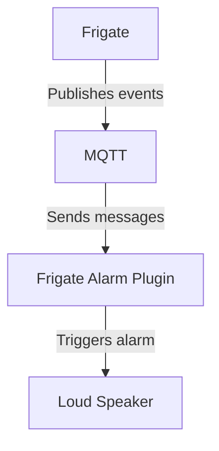
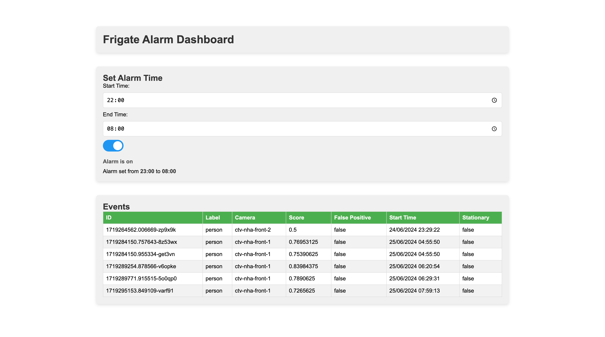

# frigate-alarm-plugin

Custom plugin for frigate to listen on events from MQTT broker and send notification on external loud speaker.

```mermaid
graph TD
    A[Frigate] --> |Publishes events| B[MQTT]
    B --> |Sends messages| C[Frigate Alarm Plugin]
    C --> |Triggers alarm| D[Loud Speaker]
```

